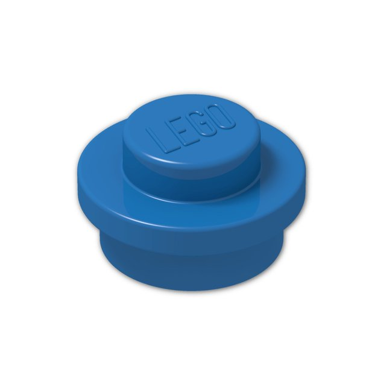

# Overview

Looking at lego set no. 21313 (ship in bottle) I was wondering about 1x1 round pieces. Mentioned set contains 284 this round elements and it barely fills bottom of the bottle, hence I got curious how many of them would we need to fill whole bottle. As I was doing research I found mosaics made from similar elements and number of them was ten times higher than what we could see in bottle set. 

# Aim

Even though I conlcuded few models amongst which one aimed to estimate number I have no way of testing them. Obviously I could just pour elements, but It assumes that I will have them in the first place. As a solution I created simple simulations in Blender, which is kind of slow and not particularly meant to be simulation program. I thought the easiest way to do it without blender would be to use pybullet engine to simulate rigid bodies of elements without actually loading all graphic elements and blender libraries. 

# Calculations

Quickly I formed few models to estimate how much space would it take.

## Optimal variable grid pattern

This was first thing to come to my mind. It was supposed to be upper boundary of element count in "perfect" optimized position. Elements are positioned in grid and next layers are put with offset.

*Equations and image ref to be added.*

## Optimal grid pattern

I am not sure why I did not thought about it ealier, however offset is unnecessary and elements can be positioned in perfect grid so that element count in given space can be even higher.

*Equations and image ref to be added.*

## Optimal sphere pattern

This model was first approximation of supposed number of elements. I made it with assumption that studs are very similar to spheres, so that rotation won't matter, and as we pour them they naturally position themselves in a way to form hexagonal patterns.

*Equations and image ref to be added.*

## Least optimal sphere pattern

This is supposed to be lower bound of elements. Not only it assumes that bricks are spheres, but also places them in normal square grid in which case they take as much space as possible.

*Equations and image ref to be added.*
